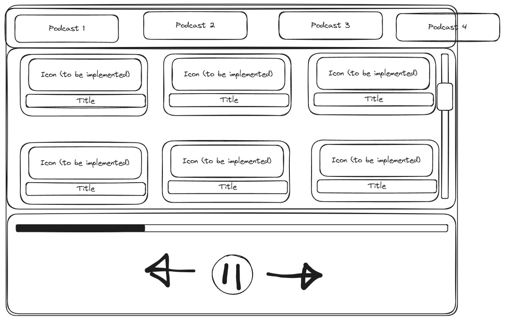

# ok
- Etter hvert oppdatere slik at ikke bare lyd blir sendt over, men også mer info.
- Oppdatere navn slik at det ikke er beef\navn og kanskje fjerne .mp3
- separere database og server?
- Legge til funksjonalitet for å skrive podcaster til `podcasts.json` i stedet for å laste ned episoder.

## drømmen

## pressende
- helt klart en alternativ måte å håndtere podcaster er å ikke sende selve lydfilen.
- Det tar 5 sekunder for 10 korte episoder.
- Best er å sende for episoden når den er valgt!